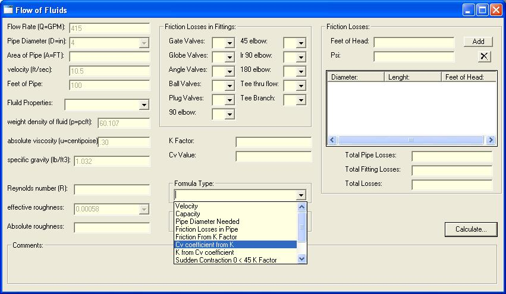



## Fluid calculator

### Description

Fluid calculator, Great for Process Engineers. Diameter of pipe needed, friction loses and more.
 
### More Info
 

             |
---                |---
**Submitted On**   |2007-03-20 10:33:48
**By**             |[Michael VanHoose](https://github.com/Planet-Source-Code/PSCIndex/blob/master/ByAuthor/michael-vanhoose.md)
**Level**          |Beginner
**User Rating**    |5.0 (25 globes from 5 users)
**Compatibility**  |VB 5\.0, VB 6\.0
**Category**       |[Complete Applications](https://github.com/Planet-Source-Code/PSCIndex/blob/master/ByCategory/complete-applications__1-27.md)
**World**          |[Visual Basic](https://github.com/Planet-Source-Code/PSCIndex/blob/master/ByWorld/visual-basic.md)
**Archive File**   |[Fluid\_calc2054923202007\.zip](https://github.com/Planet-Source-Code/michael-vanhoose-fluid-calculator__1-68176/archive/master.zip)

